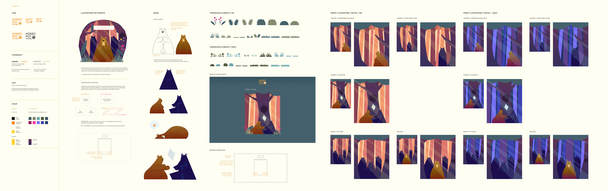
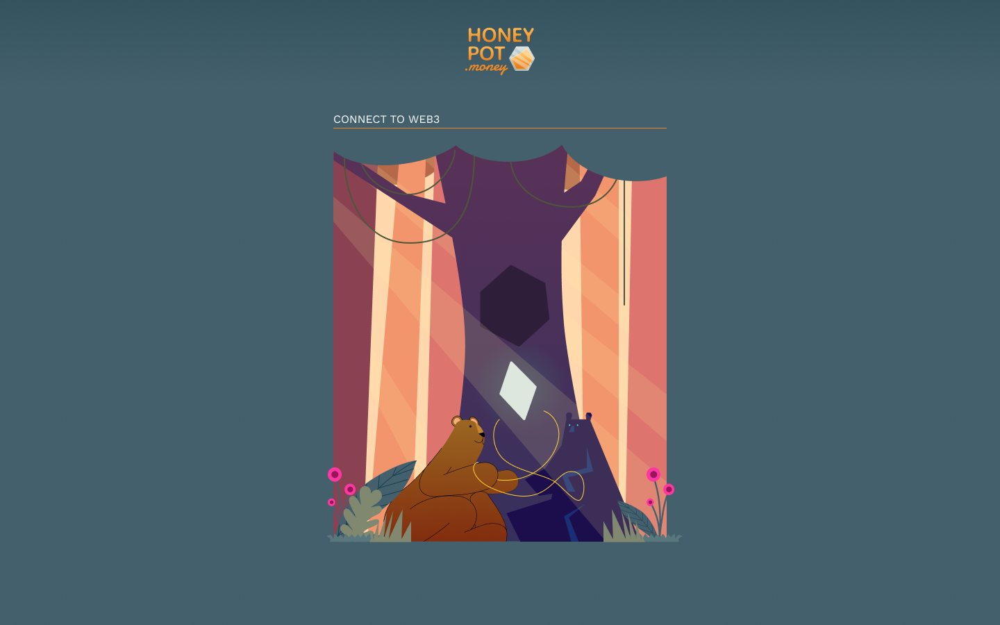
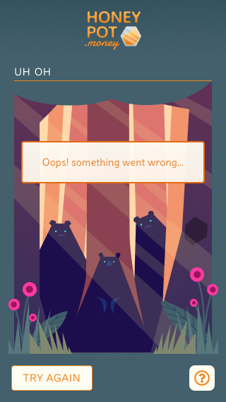
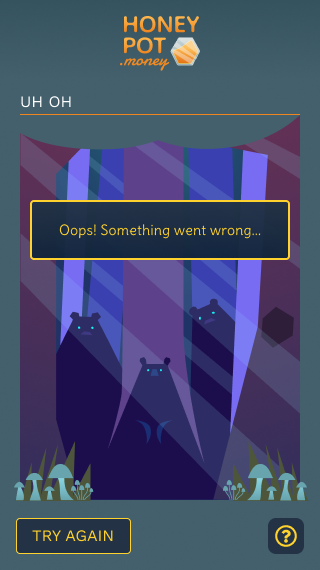

# HoneypotMoney_Design Guide
 Hello! This is the Design Guide for Honeypot.money :)
 
 Below are the links to the Figma file where you'll find more of the assets as well as thorough guidelines for them. Let me know if you have any questions / need editing permissions!


[UI Figma](https://www.figma.com/file/HlsjRxOOuz4LiB8JvMTE1L/Honeypot.money_UI?node-id=85%3A0)

[Brand/Style Guide Figma](https://www.figma.com/file/4wdEvfIvzTlMbllb39Wrnc/Honeypot.money_Branding?node-id=41%3A0)

Also, here is a demo link showing showing how the randomized foreground composition and day/night graphics work:

[Demo - Day + Night, Foreground Elements Composition](https://supersecretbanana.com/honeypot/demo/)



---
## Assets and Graphics

I've included the assets and graphics folder containing all the illustrations - an assembly guide can be found below if you want to follow the day / night scheme + randomized foreground elements to make each page load create unique foreground compositions.

I've also included preset graphics where the foreground elements and illustrations are already combined into one image (.svg or .png file) (preset_graphics folder) if you prefer - treat them as an image that is centered on the screen.

---
## Branding

You can find the complete style guide in the [Brand/Style Guide Figma](https://www.figma.com/file/4wdEvfIvzTlMbllb39Wrnc/Honeypot.money_Branding?node-id=41%3A0)

---
## UI / Elements

### Buttons, Icons, Components

Buttons and icons are inside the assets folder (svg and png available, let me know if you need other formats) The [UI Figma](https://www.figma.com/file/HlsjRxOOuz4LiB8JvMTE1L/Honeypot.money_UI?node-id=85%3A0) also has all available assets as well as their day/night and mobile/desktop variants 

### Mobile / Desktop

Mobile and desktop versions of the screens are also available - desktop screens have larger graphics (labeled with _desktop). Both graphics should be centered and placed behind foreground elements. Please refer to the [UI Figma](https://www.figma.com/file/HlsjRxOOuz4LiB8JvMTE1L/Honeypot.money_UI?node-id=85%3A0) for more info

---
## Assembly



### Demo
[Here](https://supersecretbanana.com/honeypot/demo/) is a link to a responsive demo in HTML + CSS + bits of JS that gets hour and either displays day/night graphics:

- get hour
- if between 6am - 8pm, adds '.morning'
- if between 9pm - 5am, adds '.night'

foreground composition
- each side will have one 'flower', 'plant', and 'grass'
- an array is listed for left and right versions flowers, plants, and grass
- element is randomly chosen from each
- if between 6am - 8pm, uses day array
- if between 9pm - 5am, uses night array

More info in lock-up is available in the Figma guide. You can find the HTML/CSS files inside the 'demo' folder.

### Day / Night
Compositions are divided between the day/night graphics (illustration) and an array of day/night foreground elements. My idea is to either show day/night mode based on local time.

```
let hour = new Date().getHours();
if (hour >= 6 && hour <= 18) {
    //load morning graphics + elements
} else {
    //load night graphics + elements
}
```




### Foreground Elements
Foreground elements (foreground_elements folder) are named in a way where you can easily randomize selection by changing their number (day_01_l, night_02_r). If you prefer to not mess with randomization, preset graphics with combined foreground elements and illustrations are also available. 

Also, these are are definitely open for better options especially with implementation :)

Feel free to reach out if you need any help!

-Melvin